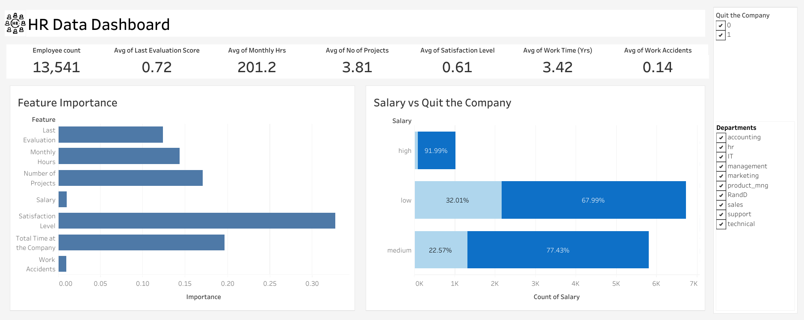

# hr_data_analysis
This project analyzes employee attrition trends within a corporate environment to identify factors contributing to employees leaving the company and predict employee turnover.

# Project Overview
The dataset comprises HR-related metrics such as employee satisfaction, performance evaluation, workload, and salary levels. The analysis integrates data preprocessing, exploratory data analysis (EDA), feature engineering, and predictive modeling to understand attrition patterns and predict employee turnover.

# Project Objectives
The goal of this project is to identify key factors influencing employee attrition, develop a predictive model to classify employees who are likely to leave and provide actionable insights to HR for improving retention strategies.

# Technologies Utilized
- Python
- Numpy
- Pandas
- Matplotlib
- Seaborn
- sklearn
- Pickle

# Methods Used
- Data Cleaning
- Exploratory data analysis
- Feature engineering
- Data preprocessing
- Model training, testing and evaluation

# Key Findings
- Employees with lower satisfaction levels were more likely to leave.
- Attrition rates were higher among employees with low salaries and those not promoted in the last five years.
- Certain departments exhibited higher attrition trends than others.
- The top predictive features included Satisfaction Level, Total Time at the Company, Number of Projects, and Monthly Hours.
  
# Recommendations
- **Increase Satisfaction Levels**: Design tailored retention strategies for high-risk groups and enhance regular employee feedback.
- **Milestone-Based Incentives**: Offer clear career progression paths to motivated employees and rewards at key tenure milestones.
- **Workload Balancing**: Monitor and optimize workload to prevent burnout.

By implementing the suggested strategies, organizations can proactively address employee attrition, fostering a productive and satisfied workforce.
